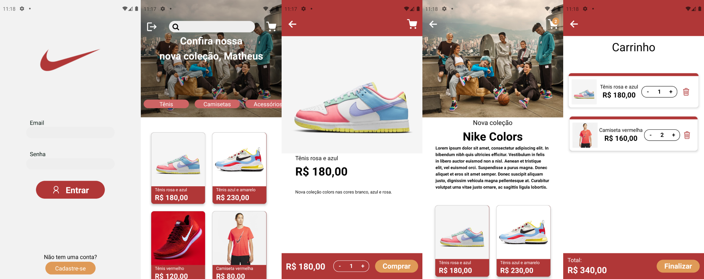

# Shop App

This is an application of a generic shop with auth and using api made for him in [shop-api](https://github.com/matheustsdev/shop-api)

## Screenshots



## Setup

Go to the desired folder and run

```bash
  $ git clone https://github.com/matheustsdev/shop-app.git

  $ cd ignews
```

Then, install the packages and run the development server with:
(NPM)

```bash
  $ npm install

  $ npm run start
```

or: (YARN)

```bash
  $ yarn

  $ yarn start
```

And you're ready to go!

## Stack

**Mobile:** React Native, Expo, Typescript, Context API, Axios and Styled Component

## Autor

- Github: [@matheustsdev](https://github.com/matheustsdev)
- Linkedin: [Matheus Teixeira](https://www.linkedin.com/in/matheust0105/)
